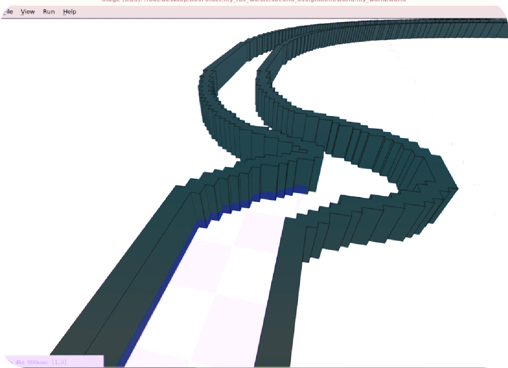

# Photorealistic simulator of a robot racing as live online experience in real time


## Description
An assignment of the "Research Track 1" course from Università di Genova.
A demonstration of a mobile robot that uses ROS, roscpp and a stageros node with a racing track. Robot must race through the track while avoiding obstacles.

## Running the program
In order to run the program a ROS instalation is required. Visit wiki.ros.org/ROS/Installation for more details. Clone the repository into your ROS workspace's src/ folder.
In your main ROS workspace run:
```
catkin_make
```
To get the "track" run the stageros node (aquired from module second_assigment)
```
rosrun stage_ros stageros $(rospack find second_assignment)/world/my_world.world
```
Run the robotLogic and robotUI nodes in separate consoles
```
rosrun assigmentRT2 assigmentRT2_robotLogic
rosrun assigmentRT2 assigmentRT2_UI
```
## Description
The **robotLogic** and **stageros node** are two main required nodes. UI is optional. Two main nodes communicate through *services* (although one custom made) and *topics*
"/base_scan" and its *ranges[]* data
"/cmd_vel" geometry_msgs::Twist messages

How to control the (cube) robot from UI node:
"w" - increase user robot velocity "s" - decrease user robot velocity
"r" - reset robot position

## Pseudocode
### robotLogic

### UI
